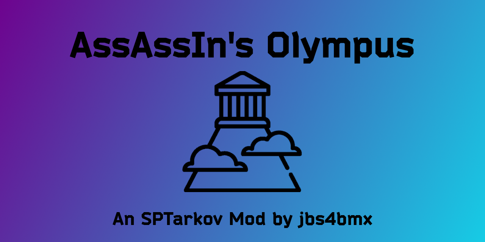

<a id="readme-top"></a>

[![Contributors][contributors-shield]][contributors-url]
[![Forks][forks-shield]][forks-url]
[![Stargazers][stars-shield]][stars-url]
[![Issues][issues-shield]][issues-url]
[![MIT License][license-shield]][license-url]

<br />
<div align="center">
  <a href="https://github.com/jbs4bmx/Olympus">
    
  </a>

  <h3 align="center">AssAssIn's Olympus</h3>

  <p align="center">
    The clouds above Mt. Olympus crack with a thunderous roar.<br>
    Your time has come. The gods beckon you to their battle.
  </p>

  [](https://ko-fi.com/X8X611JH15)
</div>

---

## About the Project
**Type:** Server Mod<br>
**Requires:** N/A<br>
**Disclaimer:** Provided *as-is* with no guarantee of support.

>***⚡ Zeus grants you access to enhanced gear for your quests.***<br>
>***⚡ Hestia's selflessness provides you the courage and power to smite your enemies.***<br>
>***⚡ Hera, Poseidon, Demeter, Athena, Apollo, Artemis, Ares, Hephaestus, Aphrodite, Hermes, and Dionysus rally you on as you storm into battle.***

This is a re-worked version of AssAssIn's Olympus mod for SPT. This mod adds rigs, armor, a helmet, a backpack, stimulants, and magazines with OP properties. The items are all sold by Therapist, Ragman, or Jaeger depending on what type of item they are.

### Items Added
**Ares' Magazines (80 in total):**
  - Configurable capacity.
  - OP Accuracy.
  - OP Ergonomics.
  - Reduced Recoil.
  - Reduced Loudness.
  - Reduced Malfunction chance.
  - Reduced Check time.
  - Slightly increased examine and loot experience.
  - Greatly reduced item weight.

**Apollo's Stim/Propital/Pain/CMS Stimulants:**
  - OP stats boost depending on stimulant used.
  - OP pain relief or damage repair depending on stimulant used.
  - No negative side affects from usage.
  - Configurable uses per Stimulant.
  - Configurable length of benefits.(Currently WIP)

**Armor Of Athena:**
  - Full body armor protecting the chest/back/sides/upper arms/stomach.
  - Configurable armor protection.
  - Class 10 Armor. (The highest available.)

**Atlas' Satchel:**
  - An incredibly spacious bag to hold the spoils of battle.
  - It may look small, but it's bigger on the inside.
  - Configurable sizes

**Hercules' Rig v1/Rig v2:**
  - Grants the wearer immense strength to carry more spoils from their battle. (aka. Greatly decreased item weight.)
  - Rig v2 is also an armored rig for those more intense battles.

**Helmet Of Hermes:**
  - Full protection of the Head (top/back/ears/eyes/jaws).
  - Class 10 Armor. (The highest available.)

<p align="right">(<a href="#readme-top">back to top</a>)</p>

### Firearm Support
There is no support for grenade launchers as well as no support for stationary, revolving, or single-shot firearms.</br>
If a firearm doesn't have a "magazine", then it is not supported.</br>
| Firearm | Supported |   | Firearm | Supported |   | Firearm | Supported |   | Firearm | Supported |   | Firearm | Supported |
| ---: | :--- | --- | ---: | :--- | --- | ---: | :--- | --- | ---: | :--- | --- | ---: | :--- |
| 9A-91 | ✅ |   | AA-12 Gen 1 | ✅ |   | AA-12 Gen 2 | ✅ |   | ADAR 2-15 | ✅ |   | AK-101 | ✅ |
| AK-102 | ✅ |   | AK-103 | ✅ |   | AK-104 | ✅ |   | AK-105 | ✅ |   | AK-12 | ✅ |
| AK-74 | ✅ |   | AK-74M | ✅ |   | AK-74N | ✅ |   | AKM | ✅ |   | AKMN | ✅ |
| AKMS | ✅ |   | AKMSN | ✅ |   | AKS-74 | ✅ |   | AKS-74N | ✅ |   | AKS-74U | ✅ |
| AKS-74UB | ✅ |   | AKS-74UN | ✅ |   | APB | ✅ |   | APS | ✅ |   | AS VAL | ✅ |
| ASh-12 | ✅ |   | AUG A1 | ✅ |   | AUG A3 | ✅ |   | AUG A3 (Black) | ✅ |   | AVT-40 | ✅ |
| AXMC | ✅ |   | Blicky | ✅ |   | Desert Eagle L5 .357 | ✅ |   | Desert Eagle L5 .50 AE | ✅ |   | Desert Eagle L6 | ✅ |
| Desert Eagle L6 (WTS) | ✅ |   | Desert Eagle Mk XIX | ✅ |   | DT MDR 5.56x45 | ✅ |   | DT MDR 7.62x51 | ✅ |   | DVL-10 | ✅ |
| FN 5-7 | ✅ |   | FN 5-7 (FDE) | ✅ |   | G28 | ✅ |   | G36 | ✅ |   | Glock 17 | ✅ |
| Glock 18C | ✅ |   | Glock 19X | ✅ |   | HK 416A5 | ✅ |   | KS-23M | ✅ |   | M1911A1 | ✅ |
| M1A | ✅ |   | M3 Super 90 | ✅ |   | M45A1 | ✅ |   | M4A1 | ✅ |   | M590A1 | ✅ |
| M60E4 | ✅ |   | M60E6 | ✅ |   | M60E6 (FDE) | ✅ |   | M700 | ✅ |   | M870 | ✅ |
| M9A3 | ✅ |   | MCX | ✅ |   | MCX-SPEAR | ✅ |   | Mk-18 | ✅ |   | Mk47 | ✅ |
| Mosin Infantry | ✅ |   | Mosin Sniper | ✅ |   | MP-133 | ✅ |   | MP-153 | ✅ |   | MP-155 | ✅ |
| MP-443 Grach | ✅ |   | MP5 | ✅ |   | MP5K-N | ✅ |   | MP7A1 | ✅ |   | MP7A2 | ✅ |
| MP9 | ✅ |   | MP9-N | ✅ |   | MPX | ✅ |   | OP-SKS | ✅ |   | P226R | ✅ |
| P90 | ✅ |   | PB pistol | ✅ |   | PKM | ✅ |   | PKP | ✅ |   | PKTM | ✅ |
| PL-15 | ✅ |   | PM (t) pistol | ✅ |   | PM pistol | ✅ |   | PP-19-01 | ✅ |   | PP-9 Klin | ✅ |
| PP-91 Kedr | ✅ |   | PP-91-01 Kedr-B | ✅ |   | PPSh-41 | ✅ |   | RD-704 | ✅ |   | RFB | ✅ |
| RPD | ✅ |   | RPDN | ✅ |   | RPK-16 | ✅ |   | RSASS | ✅ |   | SA58 | ✅ |
| SAG AK | ✅ |   | SAG AK Short | ✅ |   | Saiga-12K | ✅ |   | Saiga-12K FA | ✅ |   | Saiga-9 | ✅ |
| SCAR-H | ✅ |   | SCAR-H (FDE) | ✅ |   | SCAR-H X-17 | ✅ |   | SCAR-L | ✅ |   | SCAR-L (FDE) | ✅ |
| SKS | ✅ |   | SR-1MP Gyurza | ✅ |   | SR-25 | ✅ |   | SR-2M | ✅ |   | SR-3M | ✅ |
| STM-9 | ✅ |   | SV-98 | ✅ |   | SVDS | ✅ |   | SVT-40 | ✅ |   | T-5000M | ✅ |
| TOZ-106 | ✅ |   | TRG M10 | ✅ |   | TT pistol | ✅ |   | TT pistol (gold) | ✅ |   | TX-15 DML | ✅ |
| UMP 45 | ✅ |   | USP .45 | ✅ |   | UZI | ✅ |   | UZI PRO Pistol | ✅ |   | UZI PRO SMG | ✅ |
| Vector .45 | ✅ |   | Vector 9x19 | ✅ |   | Velociraptor | ✅ |   | VPO-101 | ✅ |   | VPO-136 | ✅ |
| VPO-209 | ✅ |   | VPO-215 | ✅ |   | VSK-94 | ✅ |   | VSS Vintorez | ✅ |   | CR 200DS | ❌ |
| CR 50DS | ❌ |   | FN40GL | ❌ |   | M32A1 | ❌ |   | MP-18 | ❌ |   | MP-43 sawed-off | ❌ |
| MP-43-1C | ❌ |   | MTs-255-12 | ❌ |   | RSh-12 | ❌ |   |   |   |   |   |   |   |

<p align="right">(<a href="#readme-top">back to top</a>)</p>

---

## Getting Started

### Prerequisites
- SPT 4.0.0+
- EFT 40087 installed

### Installation
1. Download the latest release from the [Releases](https://github.com/jbs4bmx/Olympus/releases) page..
2. Extract the contents into your **SPT root folder** (same location as `EscapeFromTarkov.exe`).
3. Edit `config.jsonc` to customize coverage, prefab, and item properties.
4. Start `SPT.Server.exe` and wait for it to fully load.
5. Launch the game through `SPT.Launcher.exe`.

Follow these steps to install and configure the mod:
  1. Extract the contents of the zip file into the root of your [SPT] folder.
     - That's the same location as "SPT.Server.exe" and "SPT.Launcher.exe".
  2. Edit the Config to adjust the values to your liking.
  3. Start SPT.Server.exe and wait until it fully loads.
  4. Start SPT.Launcher.exe.
  5. Now you can launch the game and profit.

<p align="right">(<a href="#readme-top">back to top</a>)</p>

---

## Configuration
All settings are controlled through `config.jsonc`. You can adjust:
  - How long it takes to use a stim. (default: 2)
  - Carry more weight by setting Hercules' rig or Hercules' rig 2 to a lower value.
  - Increase or decrease armor amounts for armored items.
  - Adjust the capacity of Atlas' Satchel.
  - Modify magazine stats.

The values that you see in the example below are the default values of the mod.<br>
``` jsonc
{
	//==STIMCONFIG=============================================================
	// How long should it take to use a stim?
	"StimUseTimeSeconds": 2,

	// How long should pain suppression last? Default is 120. (0 to disable)
	// WIP: Not sure if this is working yet.
	"PainSuppressionDurationSeconds": 0,

	// How long should energy regeneration last? Default is 180. (0 to disable)
	// WIP: Not sure if this is working yet.
	"EnergyRegenDurationSeconds": 0,

	// How long should hydration regeneration last? Default is 180. (0 to disable)
	// WIP: Not sure if this is working yet.
	"HydrationRegenDurationSeconds": 0,


	//==RIGSCONFIG=============================================================
	// Hecules' rig. (weight must be negative)
	// Double the value of this setting. The game halves it for some reason.
	// If you want the value in game to be -1000, set this to -2000.
	"Herc1RigWeightDrop": -1000,

	// Hercules' armored rig. (weight must be negative)
	// Double the value of this setting. The game halves it for some reason.
	// If you want the value in game to be -1000, set this to -2000.
	"Herc2RigWeightDrop": -500,

	// Hercules' armored rig armor amount.
	"Herc2ArmorAmount": 2000,

	// Atlas' satchel. Default is set to 1080p compatibility.
	// Maximum recommended values based on screen size for following options:
	// 1080p -> [24h x 14v]
	// 1440p -> [32h x 16v]
	// 2160p -> [40h? x 20v?] (4K is currently untested)
	"PackGridVertical": 14,
	"PackGridHorizontal": 24,

	// Athena's armor.
	"AthenaArmorAmount": 2000,

	// Hermes' helmet.
	"HelmetArmorAmount": 2000,


	//==MAGSCONFIG=============================================================
	// Accuracy bonus for all mags. (Negative values reduce accuracy)
	"AccuracyBonusAmount": 50,

	// Reduce recoil by this amount for all mags. (Negative values reduce recoil)
	"RecoilReductionAmount": -75,

	// Increase ergo by this amount for all mags.
	"ErgoIncreaseAmount": 50,

	// Increase velocity by this amount for all mags.
	"VelocityIncreaseAmount": 50,

	// Chance for a mag to malfunction when used. (0 = 0% Chance; 1.0 = 100% Chance)
	"MalfunctionChance": 0,

	// Make it easier to get better mags? Sets all mags to loyalty level 1 if true. (WIP: May not work properly)
	"SetAllMagsLoyaltyLevelOne": false,


	//==BLACKLISTCONFIG========================================================
	"BlacklistStims": false,
	"BlacklistRigs": false,
	"BlacklistMags": false,


	//==DEVELOPERCONFIG========================================================
	"EnableDebugLogging": false
}
```

<p align="right">(<a href="#readme-top">back to top</a>)</p>

---

## Troubleshooting

**Rig 2 doesn't show armor areas**
- A slight bug but the armor still works, I assure you. You have my "Trust Me Bro" guarantee.

**Not all magazines are showing under Jaeger LL1**
- The current option to set all magazines to LL1 is a WIP. It will likely not work at this time.

<p align="right">(<a href="#readme-top">back to top</a>)</p>

---

## Roadmap
- [❓] Add new trader for selling of custom items. (Not yet implemented in current release.)
- [✅] Add custom trader avatar for new trader. (Not yet implemented in current release.)
- [✅] Add alternative trader avatar for use with trader image switching mods. (Not yet implemented in current release.)
- [❓] Add new questline for advancement with new trader.
- [❓] Add even more variations of magazines with different properties based on item levels.
- [✅] Update code for SPT Server v4.0.0 (New server is written in C#)

Suggest changes or report issues here: [ISSUES](https://github.com/jbs4bmx/Olympus/issues).

<p align="right">(<a href="#readme-top">back to top</a>)</p>

---

## Contributing
Contributions are welcome!
If you have ideas or improvements:

1. Fork the repository
2. Create a feature branch
3. Commit your changes
4. Open a pull request

Or simply open an issue tagged **enhancement**.

If you'd like to support development:
[](https://ko-fi.com/X8X611JH15)

<p align="right">(<a href="#readme-top">back to top</a>)</p>

---

## License
Distributed under the MIT License.
See `LICENSE` for details.

<p align="right">(<a href="#readme-top">back to top</a>)</p>


<!-- Repository Metrics -->
[contributors-shield]: https://img.shields.io/github/contributors/jbs4bmx/Olympus.svg?style=for-the-badge
[contributors-url]: https://github.com/jbs4bmx/Olympus/graphs/contributors
[forks-shield]: https://img.shields.io/github/forks/jbs4bmx/Olympus.svg?style=for-the-badge
[forks-url]: https://github.com/jbs4bmx/Olympus/network/members
[stars-shield]: https://img.shields.io/github/stars/jbs4bmx/Olympus.svg?style=for-the-badge
[stars-url]: https://github.com/jbs4bmx/Olympus/stargazers
[issues-shield]: https://img.shields.io/github/issues/jbs4bmx/Olympus.svg?style=for-the-badge
[issues-url]: https://github.com/jbs4bmx/Olympus/issues
[license-shield]: https://img.shields.io/github/license/jbs4bmx/Olympus.svg?style=for-the-badge
[license-url]: https://github.com/jbs4bmx/Olympus/blob/master/LICENSE.txt